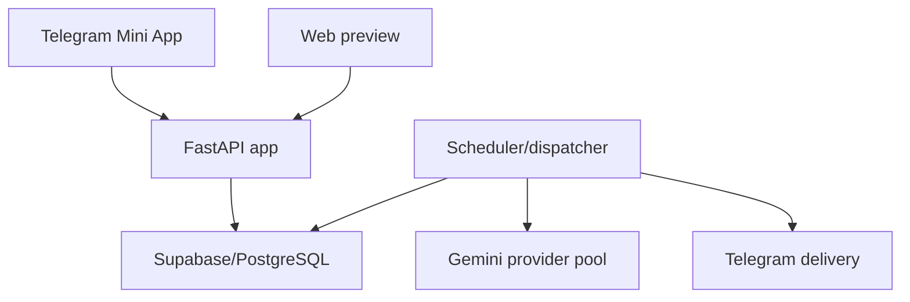

# Architecture

## Canonical topology

The canonical application is a same-origin FastAPI service. It serves the Mini App, public answer-free projections, authenticated learner APIs and health/version endpoints. GitHub Pages may render a static preview under a repository subpath, but it is not an authenticated application or production target.

## Trust boundaries

- Telegram `initData` HMAC and freshness validation establishes learner identity for authenticated operations.
- The browser never receives answer keys before scoring. Public quiz/test projections are explicitly answer-free.
- Scoring, first-attempt official status and daily timing are database-authoritative and idempotent.
- Client duration and per-question response times are telemetry only.
- Personalized responses are never publicly cached. Immutable answer-free projections may use an ETag and CDN cache.
- Service-role database credentials remain server-side. Public database functions use explicit permissions and contract checks.
- Question publication requires an auditable evidence basis and real generator/verifier identities.

## Main components

| Area | Responsibility |
|---|---|
| `app.py` | FastAPI composition, security headers, authentication boundary and shared request guards. Focused HTTP surfaces live under `routes/`. |
| `services/` | Use cases, validation, verification, dispatch, readiness and privacy orchestration. |
| `storage/` | Supabase/PostgreSQL RPC adapters and result validation. |
| `supabase/migrations/` | Forward-only schema, RLS, function, permission and integrity contracts. |
| `bot.py` | Subject generation/posting and CLI composition entry point. Scheduled-job health, dispatch and recovery orchestration lives in `services/quiz_dispatch_runtime.py`. |
| `scripts/` | Operator validation, source refresh, migration and deployed smoke tools. |
| HTML/shared shell/worker | Mobile learner UI and base-aware PWA behavior. |

## Operational truth

`docs/PRODUCTION_RELEASE_AND_ROLLBACK.md` is the current release procedure. `/version` identifies the running application artifact; `/health/ready` checks configuration and database contracts. A release is not accepted until the deployed authenticated smoke and content-completeness evidence pass.
